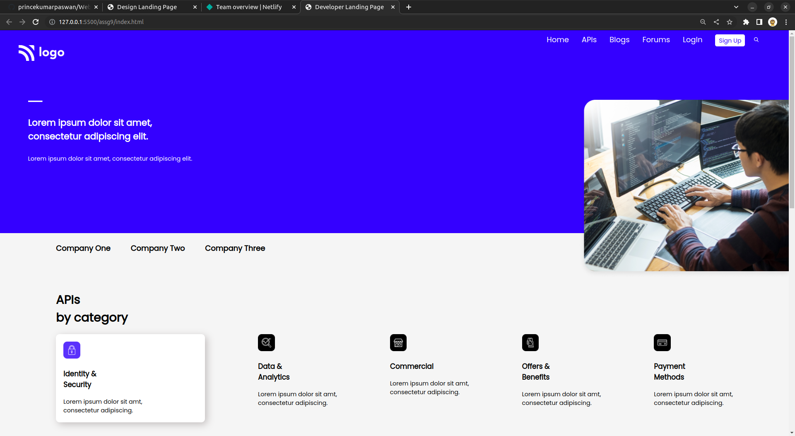
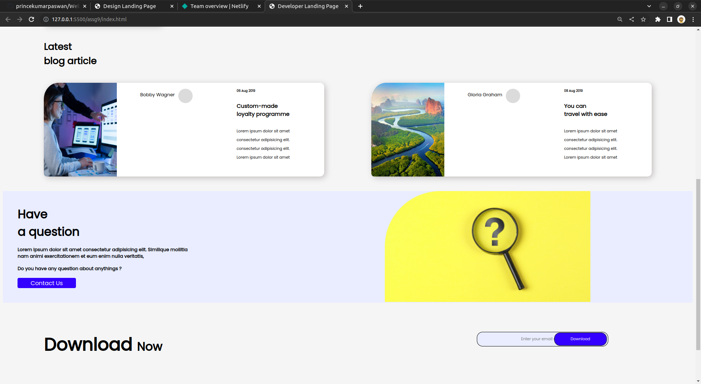
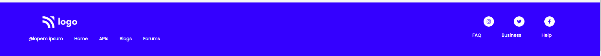

# API | Page - HTML & CSS!

By Prince Kr Paswan

## [Link to the Developer Landing-Page (project-9)](https://developerlanding-page.netlify.app/)

## What I learned While creating this page?

- learned about one corner border radius.
- learned how to make cards.
- Learnd to use css position  property.
- I learned how to add custom fonts.
- I learned about image positioning and image hight.

## This project took around 6 hours to complete.
